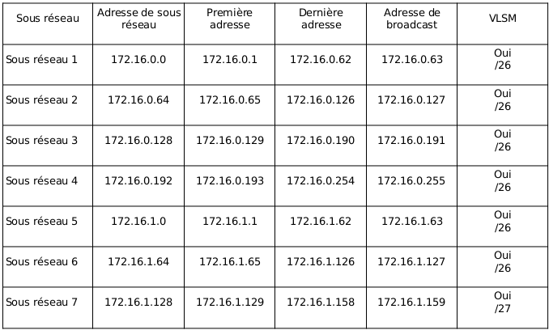
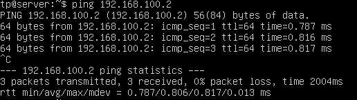
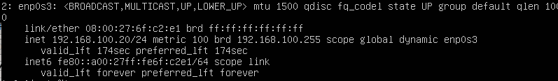
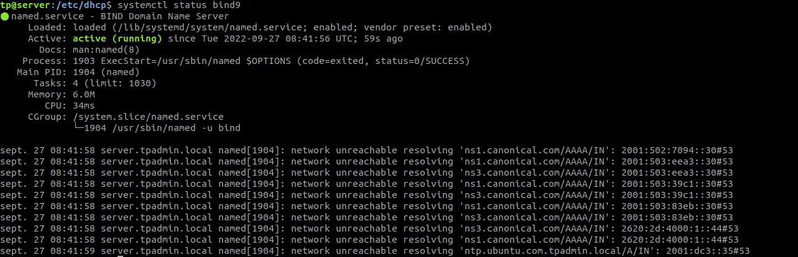
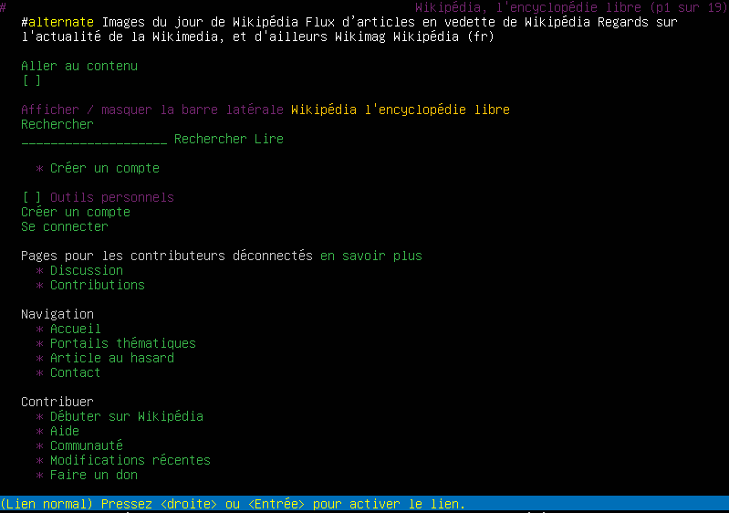
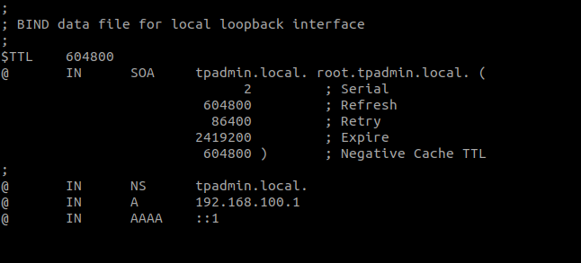
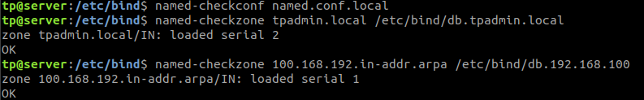

# Exercice 1. Adressage IP (rappels)

Vous administrez le réseau interne 172.16.0.0/23 d'une entreprise, et
devez gérer un parc de 254 machines réparties en 7 sous-réseaux. La
répartition des machines est la suivante :

-   Sous-réseau 1 : 38 machines

-   Sous-réseau 2 : 33 machines

-   Sous-réseau 3 : 52 machines

-   Sous-réseau 4 : 35 machines

-   Sous-réseau 5 : 34 machines

-   Sous-réseau 6 : 37 machines

-   Sous-réseau 7 : 25 machines

Donnez, pour chaque sous-réseau, l'adresse de sous-réseau, l'adresse de
broadcast (multidiffusion) ainsi que les adresses de la première et
dernière machine confgurées (précisez si vous utilisez du VLSM ou pas).




# Exercice 2. Préparation de l'environnement


1.  VM éteintes, utilisez les outils de configuration de VirtualBox pour
    mettre en place l'environnement décrit ci-dessus.

    Aller dans « Modifier la configuration de la VM » puis ajouter une carte
    réseau au serveur, sélectionner le réseau ICS_E6_2006 puis modifier le
    réseau de la carte du client et sélectionner le même.

2.  Démarrez le serveur et vérifiez que les interfaces réseau sont bien
    présentes. A quoi correspond l'interface appelée lo?

   > L'interface lo correspond à l'interface de loopback de la machine.

3.   Dans les versions récentes, Ubuntu installe d'office le paquet
    cloud-init lors de la configuration du système. Ce paquet permet la
    configuration et le déploiement de machines dans le cloud via un
    script au démarrage. Nous ne nous en servirons pas et sa présence
    interfère avec certains services (en particulier le changement de
    nom d'hôte); par ailleurs, vos machines démarreront plus rapidement.
    Désinstallez complètement ce paquet (il faudra penser à le faire
    également sur le client ensuite.)

> ```sudo apt remove cloud-init```

4.  Les deux machines serveur et client se trouveront sur le domaine
    tpadmin.local. A l'aide de la commande hostnamectl renommez le
    serveur (le changement doit persister après redémarrage, donc
    cherchez les bonnes options dans le manuel!). On peut afficher le
    nom et le domaine d'une machine avec les commandes hostname et/ou
    dnsdomainname ou en affichant le contenu du fichier /etc/hostname.

> ```hostnamectl hostname tpadmin_server```

# Exercice 3. Installation du serveur DHCP

Un serveur DHCP permet aux ordinateurs clients d'obtenir automatiquement
une configuration réseau (adresse IP, serveur DNS, passerelle par
défaut...), pour une durée déterminée. Ainsi, dans notre cas,
l'interfaces réseau de client doit être configurée automatiquement par
serveur. Le réseau local tpadmin.local a pour adresse 192.168.100.0/24
(on aurait pu choisir une autre adresse; attention, 192.168.1.0/24 est
souvent réservée, par exemple par votre FAI).

1.  Sur le serveur, installez le paquet isc-dhcp-server. La commande
    systemctl status isc-dhcp-server devrait vous indiquer que le
    serveur n'a pas réussi à démarrer, ce qui est normal puisqu'il n'est
    xpas encore configuré (en particulier, il n'a pas encore d'adresses
    IP à distribuer).

> ```sudo apt install isc-dhcp-server```

2.  Un serveur DHCP a besoin d'une IP statique. Attribuez de manière
    permanente l'adresse IP 192.168.100.1 à l'interface réseau du réseau
    interne. Vérifiez que la configuration est correcte.

> ```ip addr add 192.168.100.1/24 dev ens192```
>
> vérifier : ```ip a```

3.  La configuration du serveur DHCP se fait via le fichier
    /etc/dhcp/dhcpd.conf. Faites une sauvegarde du fichier existant sous
    le nom dhcpd.conf.bak puis éditez le fichier dhcpd.conf avec les
    informations suivantes :

    ```
    default-lease-time 120;
    max-lease-time 600;
    authoritative;
    option broadcast-address 192.168.100.255;
    option domain-name "tpadmin.local";
    subnet 192.168.100.0 netmask 255.255.255.0 { 
        range 192.168.100.100 192.168.100.240;
        option routers 192.168.100.1;
        option domain-name-servers 192.168.100.1;
    }
    ```

A quoi correspondent les deux premières lignes?

> Les deux premières lignes définissent le temps de validité par défaut
> et maximum d'une adresse IP.

4.  Editez le fichier /etc/default/isc-dhcp-server afin de spécifier
    l'interface sur laquelle le serveur doit écouter.

> ```sudo nano /etc/default/isc-dhcp-server``` puis ajouter « ens192 » à la
ligne ipv4.

5.  Validez votre fichier de configuration avec la commande dhcpd -t
    puis redémarrez le serveur DHCP (avec la commande systemctl restart
    isc-dhcp-server) et vérifiez qu'il est actif.

    

6.  Notre serveur DHCP est configuré!
    Passons désormais au client. Si vous avez suivi le sujet du TP 1, le
    client a été créé en clonant la machine virtuelle du serveur. Par
    conséquent, son nom d'hôte est toujours serveur. Vérifiez que la
    carte réseau du client est débranchée, puis démarrez le client (il
    est possible qu'il mette un certain temps à démarrer : ceci est dû à
    l'absence de connexion Internet). Comme pour le serveur,
    désinstallez ensuite cloud-init, puis modifiez le nom de la machine
    (elle doit s'appeler client.tpadmin.local).

> ```sudo ip link set enp0s3 down```
>
> ```hostnamectl hostname client.tpadmin.local```

7.  La commande tail -f /var/log/syslog affiche de manière continue les
    dernières lignes du fichier de log du système (dès qu'une nouvelle
    ligne est écrite à la fin du fichier, elle est affichée à l'écran).
    Lancez cette commande sur le serveur, puis connectez la carte réseau
    du client et observez les logs sur le serveur. Expliquez à quoi
    correspondent les messages DHCPDISCOVER, DHCPOFFER, DHCPREQUEST,
    DHCPACK. Vérifiez que le client reçoit bien une adresse IP de la
    plage spécifiée précédemment.

>DHCPDISCOVER : Le client, qui n\'a pas encore d\'adresse IP, diffuse
>une série de paquets DHCP Discover afin de localiser les serveurs DHCP.
>
>DHCPOFFER : Chaque serveur DHCP répondra avec une adresse IP que le
>client pourra utiliser. Notez que pour un DHCP normal à Stanford, où
>l\'utilisateur obtient la même adresse à chaque fois, les deux serveurs
>DHCP répondront avec la même adresse. Notez que les clients n\'envoient
>pas de découvertes (et aucune offre n\'est renvoyée) lors du
>renouvellement d\'une adresse DHCP.
>
>DHCPREQUEST: Le client demande l\'utilisation de l\'une des
>adresses fournies. Notez que, dans le cas de renouvellements, le client
>contactera directement le serveur DHCP qui a fourni l\'adresse.
>
>DHCPACK: Le serveur reconnaît (ACK) ou refuse (NAK) l\'utilisation
>de l\'adresse demandée par l\'utilisateur.

8.  Que contient le fichier /var/lib/dhcp/dhcpd.leases sur le serveur,
    et qu'afficle la commande dhcp-lease-list?

>Le fichier contient la configuration de la base de données des
>concessions initiales du serveur DHCP, avec notamment l'UID du serveur.

9.  Vérifiez que les deux machines peuvent communiquer via leur adresse
    IP, à l'aide de la commande ping.

    

10. Modifiez la configuration du serveur
    pour que l'interface réseau du client reçoive l'IP statique
    192.168.100.20 :

```
deny unknown-clients;
host client {
    hardware ethernet XX:XX:XX:XX:XX:XX;
    fixed-address 192.168.100.20;
}
```

Vérifiez que la nouvelle configuration a bien été appliquée sur le
client (éventuellement, désactivez puis réactivez l'interface réseau
pour forcer le renouvellement du bail DHCP, ou utilisez la commande
dhclient -v).

# Exercice 4. Donner un accès à Internet au client

1.  La première chose à faire est d'autoriser l'IP forwarding sur le
    serveur (désactivé par défaut, étant donné que la plupart des
    utilisateurs n'en ont pas besoin). Pour cela, il suffit de
    décommenter la ligne net.ipv4.ip_forward=1 dans le fichier
    /etc/sysctl.conf. Pour que les changements soient pris en compte
    immédiatement, il faut saisir la commande sudo sysctl -p
    /etc/sysctl.conf.

2.  Ensuite, il faut autoriser la traduction d'adresse source
    (masquerading) en ajoutant la règle iptables suivante :

```
sudo iptables \--table nat \--append POSTROUTING \--out-interface enp0s3 -j MASQUERADE
```

Vérifiez à présent que vous arrivez à « pinguer » une adresse IP (par
exemple 1.1.1.1) depuis le client.



# Exercice 5. Installation du serveur DNS

1.  Sur le serveur, commencez par installer bind9, puis assurez-vous que
    le service est bien actif.

2.  A ce stade, Bind n'est pas configuré et ne fait donc pas grand
    chose. L'une des manières les simples de le configurer est d'en
    faire un serveur cache : il ne fait rien à part mettre en cache les
    réponses de serveurs externes à qui il transmet la requête de
    résolution de nom.

Nous allons donc modifier son fichier de configuration :
/etc/bind/named.conf.options. Dans ce fichier, décommentez la partie
forwarders, et à la place de 0.0.0.0, renseignez les IP de DNS publics
comme 1.1.1.1 et 8.8.8.8 (en terminant à chaque fois par un point
virgule). Redémarrez le serveur bind9.

> ```sudo nano /etc/bind/named.conf.options```

3.  Sur le client, retentez un ping sur www.google.fr. Cette fois ça
    devrait marcher! On valide ainsi la configuration du DHCP effectuée
    précédemment, puisque c'est grâce à elle que le client a trouvé son
    serveur DNS.

    

4.  Sur le client, installez le navigateur en mode
    texte lynx et essayez de surfer sur fr.wikipedia.org (bienvenue dans
    le passé...)

    > ```lynx fr.wikipedia.org```

# Exercice 6. Confguration du serveur DNS pour la zone tpadmin.local

L'intérêt d'un serveur DNS privé est principalement de pouvoir résoudre
les noms des machines du réseau local. Pour l'instant, il est impossible
de pinguer par leur nom client depuis serveur et inversement.

1.  Modifiez le fichier /etc/bind/named.conf.local et ajoutez les lignes
    suivantes :

```
zone "tpadmin.local" IN {
    type master;
    file "/etc/bind/db.tpadmin.local";
};
```

> ```sudo nano /etc/bind/named.conf.local```

2.  Créez une copie appelée db.tpadmin.local du fichier db.local. Ce
    fichier est un fichier configuration typique de DNS, constitué
    d'enregistrements DNS (cf. cours). Dans le nouveau fichier,
    remplacez toutes les références à localhost par tpadmin.local, et
    l'adresse 127.0.0.1 par l'adresse IP du serveur.

> ```sudo cp ./db.local ./db.tpadmin.local```



3.  Maintenant que nous avons configuré notre fichier de zone, il reste
    à configurer le fichier de zone inverse, qui permet de convertir une
    adresse IP en nom.

Commencez par rajouter les lignes suivantes à la fin du fichier
named.conf.local :

```
zone "100.168.192.in-addr.arpa" {
    type master;
    file "/etc/bind/db.192.168.100";
};
```

Créez ensuite le fichier db.192.168.100 à partir du fichier db.127, et
modifiez le de la même manière que le fichier de zone. Sur la dernière
ligne, faites correspondre l'adresse IP avec celle du serveur
(Attention, il y a un petit piège!).



4.  Utilisez les utilitaires
    named-checkconf et named-checkzone pour valider vos fichiers de
    configuration :

\$ named-checkconf named.conf.local

\$ named-checkzone tpadmin.local /etc/bind/db.tpadmin.local

\$ named-checkzone 100.168.192.in-addr.arpa /etc/bind/db.192.168.100

Modifiez le fichier /etc/systemd/resolved.conf et décommentez la
section DNS.

5. Redémarrer le serveur Bind9. Vous devriez maintenant être en mesure
    de « pinguer »les différentes machines du réseau.

    >La configuration de l'OS des VM utilisées empêche de vérifier le bon
    fonctionnement des étapes produites.
